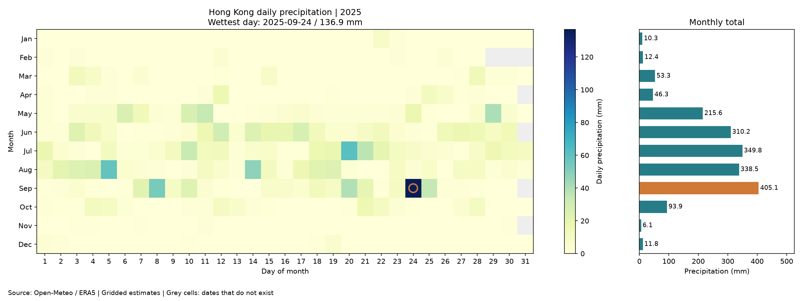

# Hong Kong Precipitation in 2025

<!-- This is the SD5913 assignment 2 template. Everything in this file is yours to
replace, and the check counts words: comments like this one are not words, so
delete each one as you write. Start with the heading: name the phenomenon.

Then, in this order, at least 150 words in total.

New to folders, paths, or the files here whose names start with a dot? Read
https://github.com/sd5913/pfad/blob/2026/reference/files.md first. Ten minutes. -->



## The phenomenon

This project looks at daily precipitation in Hong Kong in 2025. I wanted to see which months had more rain and which day had the most. I used a calendar to show each day and a bar chart to compare the monthly totals.

## The source

he data comes from the Open-Meteo Historical Weather API.

The JSON file contains 365 dates and 365 daily precipitation values. Each date matches one value, measured in millimetres (mm). The original file is saved in the data folder. The data uses ERA5 estimates for a location near Hong Kong, rather than direct measurements from a local weather station.

## What the picture shows
Darker cells mean more rain, and grey cells are dates that do not exist, such as 30 February. The orange circle shows the wettest day: 24 September, with 136.9 mm, and the orange bar shows the wettest month: September, with 405.1 mm. The chart does not show when rain fell during a day or differences between places in Hong Kong, and one year cannot show a long-term climate trend.
<!-- Two or three sentences. Including what it hides: every transformation throws
something away, and naming what yours threw away is the easiest way to sound like
you know what you did. -->

## Run it

```
uv run fetch.py
uv run plot.py
```
